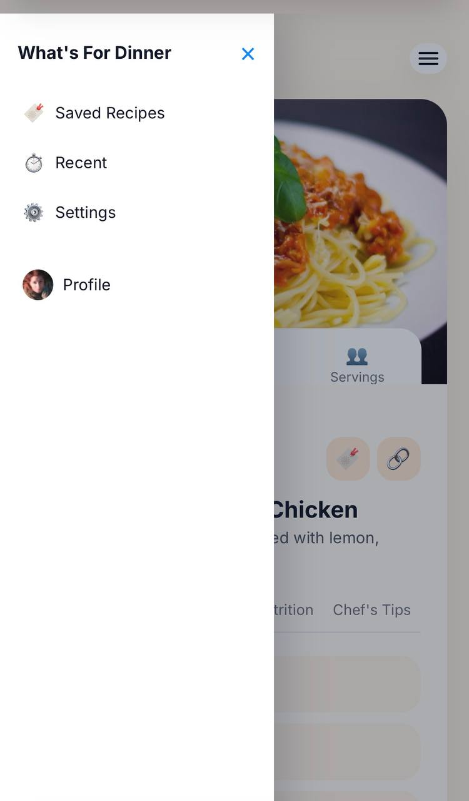

## What’s For Dinner — Responsive Recipe & Meal Suggestion App

What’s For Dinner is a clean, structured, and fully responsive web application built using pure HTML, CSS, and JavaScript.
The project serves as a demonstration of front-end development skills, including UI organization, dynamic content generation, and modern interface design without relying on external frameworks.

The application focuses on simplicity and performance, offering users an intuitive experience with clear visuals, smooth navigation, and consistent behavior across devices.

## Project Overview

This project provides a minimal yet functional interface for displaying recipes and meal suggestions.
Its goal is to explore essential front-end concepts such as:
 • Clean code structure
 • Separation of concerns between HTML, CSS, and JavaScript
 • Building interactive components without libraries
 • Managing UI states and dynamic content updates

The application is designed with an emphasis on readability, user flow, and responsive scaling for mobile and desktop views.

## Project Preview

## Key Features

To expand the functionality and elevate the user experience, the following improvements are planned for future versions of What’s For Dinner:
##  • API-Powered Recipes
Integrate external recipe APIs to provide real, diverse, and personalized meal suggestions.
##  • Advanced Search & Filtering
Add filters for categories, preparation time, difficulty, and dietary preferences such as vegan, keto, or gluten-free.
##  • Weekly Meal Planner
Introduce a dedicated planner that allows users to organize meals for the entire week.
##  • Favorites & Saved Recipes
Allow users to bookmark and store recipes locally using localStorage or a backend system.
##  • User-Submitted Recipes
Provide the option for users to upload their own recipes with images and instructions.
##  • Interactive Ingredient Checklists
Add editable ingredient lists with “checked/unchecked” states for easier cooking guidance.
##  • Dark Mode Support
Include a theme toggle for improved accessibility and user customization.
##  • Backend Integration for User Profiles
Expand into a full-stack version with authentication, user accounts, and personalized recipe recommendations.

## Core Strengths Demonstrated

 • Clean and semantic HTML layout that supports accessibility and structure
 • Well-organized CSS architecture with scalable class naming and responsive design techniques
 • Efficient vanilla JavaScript used to handle dynamic meal content and user interactions
 • Professional use of Git and GitHub for version control and deployment
 • Strong understanding of UI/UX principles, spacing, typography, and layout balance

## Technologies Used

 • HTML5
 • CSS3
 • JavaScript (Vanilla)
 • GitHub Pages for deployment

## Developer

Teef M. Karyry — TeefDev
