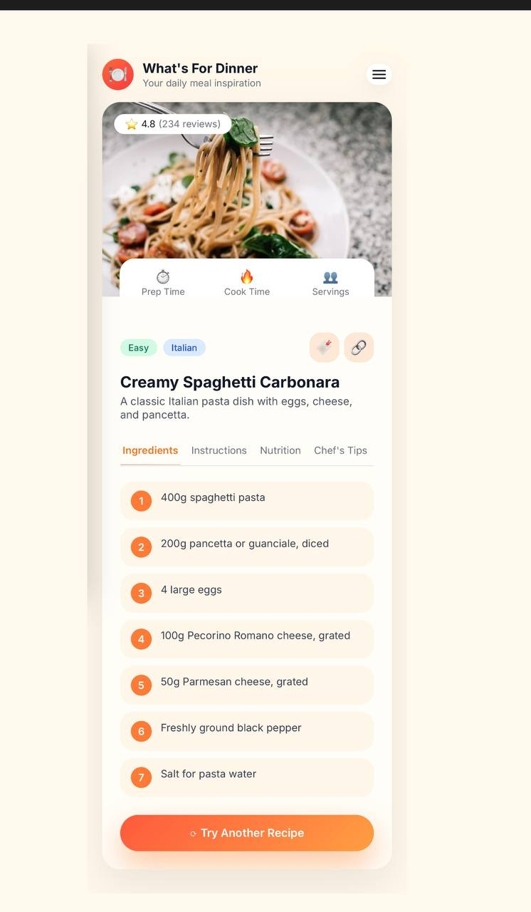
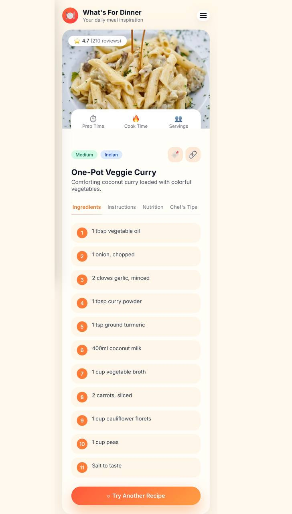
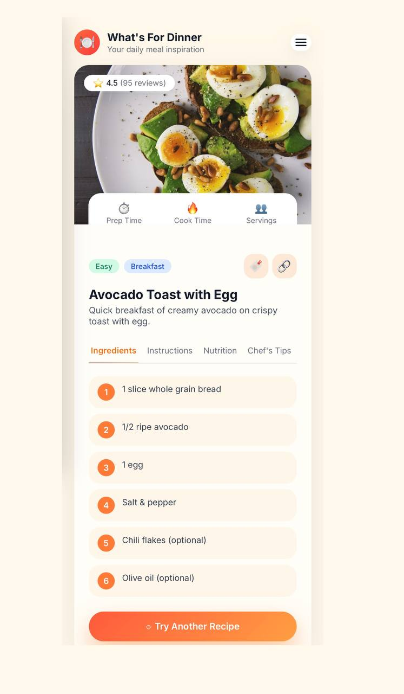

  # 🍽️ What's For Dinner?

A clean, structured, and fully responsive web application designed to deliver a seamless user experience.  
This project demonstrates strong front-end development skills, UI/UX awareness, and the ability to create functional, modern interfaces using pure HTML, CSS, and JavaScript.

The app focuses on clarity, simplicity, and performance — ensuring smooth navigation, aesthetic visuals, and consistent behavior across all devices.

---

## 🔥 Core Strengths Demonstrated
- Clean, semantic HTML layout
- Well-organized and scalable CSS architecture
- Efficient vanilla JavaScript logic for dynamic content
- Professional Git/GitHub workflow & deployment
- Strong understanding of UI/UX and responsive design

---

## 🖼️ Photo  

---

## 🛠️ Technologies  
HTML5 • CSS3 • JavaScript • GitHub Pages

---

## 👩‍💻 Developer  
Teef M. Karyry — TeefDev
